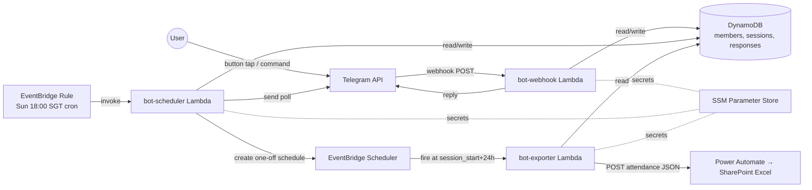

# SIT Skate Bot — Cloud-Native (AWS) Edition

Serverless rewrite of the SIT Inline Skate Club's weekly attendance bot, built as a cloud-native microservices portfolio project.

> **Framing (read this first):** This is a deliberate over-engineering of a 107-user weekly Telegram bot as a learning artifact. 107 users do not need microservices — the monolithic Phase 3 version (see `../skatetelegrambot`) runs happily on a $25 Raspberry Pi. This repo decomposes the bot into 3 independently-deployed Lambda services specifically to demonstrate event-driven architecture patterns, IaC with Terraform, and CI/CD on AWS. It is not a prescription for how to build a small club's attendance system.

---

## Architecture



### Service responsibilities

| Service | Trigger | Job |
|---|---|---|
| `bot-webhook` | Lambda Function URL (POST from Telegram) | Verify signature; dispatch admin commands + button callbacks; update poll messages live |
| `bot-scheduler` | EventBridge Rule (weekly `cron(0 10 ? * SUN *)` UTC) + EventBridge Scheduler (one-off per session) | Create new session + send poll; create one-off export schedule |
| `bot-exporter` | EventBridge Scheduler (24h post session start) | Fetch session + responses, POST JSON to Power Automate |

### Why these choices (honest framing)

- **EventBridge for inter-service decoupling instead of SQS/SNS**: at 1 event/week SQS would be forced. EventBridge's rule + scheduler combo is lighter and more AWS-native for pure time-based triggers.
- **DynamoDB instead of RDS**: serverless-native, 25 GB always-free. Access patterns are simple (KV by session_id + range queries by date) — relational joins aren't needed.
- **Lambda Function URL instead of API Gateway**: always free forever; API Gateway free tier expires at 12 months. Webhook signature verification happens in-code via Telegram's `X-Telegram-Bot-Api-Secret-Token` header.
- **Terraform instead of SAM/CDK**: cloud-agnostic IaC, transferable to other clouds, best resume signal.
- **No persistent jobstore for the scheduler**: EventBridge Scheduler is *itself* durable — one-off schedules survive Lambda restarts natively. No "rebuild from DB at startup" pattern like the Phase 3 APScheduler monolith needed.

---

## Cost reality

Monthly usage vs. AWS Always Free limits:

| Service | This bot's usage | Always Free limit | % used |
|---|---|---|---|
| Lambda requests | ~450 | 1,000,000 | 0.045% |
| Lambda compute | ~113 GB-s | 400,000 GB-s | 0.028% |
| EventBridge rule invocations | ~5 | 14,000,000 | <0.0001% |
| DynamoDB storage | <1 MB | 25 GB | <0.004% |
| CloudWatch Logs ingestion | ~10 MB | 5,120 MB | 0.2% |

Structural paywall: **impossible**. Monthly bill after deploy (verified): **$0.00**.

Billing alarms at $1 / $5 / $10 catch misconfiguration, not usage. Setup instructions in [`SETUP.md`](./SETUP.md).

---

## Repo layout

```
.
├── services/                    # one folder per Lambda
│   ├── webhook/                 # Telegram webhook handler
│   ├── scheduler/               # Cron + per-session schedule creator
│   └── exporter/                # Power Automate POST
├── shared/                      # Python modules packaged into every Lambda
│   ├── config.py                # env + SSM (with module-level cache for cold-start reuse)
│   ├── db.py                    # DynamoDB access layer (boto3)
│   ├── poll.py                  # Message text + keyboard rendering
│   └── telegram.py              # Thin httpx client for Telegram Bot API
├── infra/terraform/             # Full AWS stack definition
│   ├── main.tf                  # Backend + version pins
│   ├── providers.tf
│   ├── variables.tf
│   ├── outputs.tf
│   ├── dynamodb.tf              # 3 tables + GSI
│   ├── iam.tf                   # Least-privilege per-service roles
│   ├── lambda.tf                # 3 Lambdas + Function URL
│   ├── eventbridge.tf           # Cron rule + Scheduler role
│   ├── ssm.tf                   # Parameter placeholders
│   ├── cloudwatch.tf            # Log retention + error alarm
│   └── budget.tf                # $1/$5/$10 billing alarms
├── scripts/
│   ├── setwebhook.py            # Register Function URL with Telegram
│   └── migrate_sqlite_to_dynamo.py
├── tests/                       # Against DynamoDB Local
├── .github/workflows/deploy.yml
├── SETUP.md                     # Manual steps Joshua must do in browser
├── README.md                    # ← you are here
└── Makefile                     # Local shortcuts: test, package, dynamodb-local
```

---

## Deploy

**First time:** follow [`SETUP.md`](./SETUP.md) in order (AWS account, billing alarms, IAM, GitHub secrets). Then:

```bash
cd infra/terraform
terraform init
terraform apply
```

Then populate the SSM parameters (see SETUP.md §6) and run:
```bash
python scripts/setwebhook.py
```

**Subsequent deploys:** `git push origin main` → GitHub Actions runs `terraform plan` → manual approval on the `prod` environment → `terraform apply` → new Lambda versions live within ~5 min.

---

## Teardown

```bash
cd infra/terraform
terraform destroy
```

Removes every AWS resource created by this stack. Safe to re-run `terraform apply` later to rebuild from scratch.

---

## Local development

```bash
# Install dev deps
make install

# Start DynamoDB Local in Docker
make dynamodb-local

# Run tests
make test

# Lint + format
make lint
make fmt

# Build deployment zips (what CI does)
make package

# Stop DynamoDB Local
make dynamodb-down
```

---

## Related

- Phase 3 monolithic version (systemd-ready, Pi-deployable): `../skatetelegrambot`
- Original plan document: `../skatetelegrambot/PLAN.md`
- Attendance export spec: `../skatetelegrambot/PLAN.md` §Attendance Export

---

## Acknowledgements

The monolithic version of this bot is what the club actually uses. This repo exists for educational value — decomposing a working system into its microservice bones to learn cloud-native patterns firsthand.
