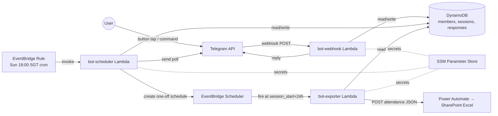

```mermaid
flowchart LR
    TG[Telegram API]
    User((User))
    User -- button tap / command --> TG
    TG -- webhook POST --> FA[Function App<br/>skatebot-prod-azure]
    FA -- contains --> WH2[webhook<br/>HTTP Trigger]
    FA -- contains --> SCHED2[scheduler<br/>Timer Trigger]
    FA -- contains --> EXP2[exporter<br/>Queue Trigger]

    WH2 -- read/write --> COSMOS[(Cosmos DB Table API<br/>members, sessions, responses)]
    WH2 -- reply --> TG

    SCHED2 -- weekly NCRONTAB Sun 10:00 UTC --> SCHED2
    SCHED2 -- read/write --> COSMOS
    SCHED2 -- send poll --> TG
    SCHED2 -- enqueue with visibility_timeout=86400 --> Q[Storage Queue<br/>export-queue]
    Q -- becomes visible at session_start+24h --> EXP2
    EXP2 -- read --> COSMOS
    EXP2 -- upload CSV --> BLOB[Blob Storage<br/>attendance/&#123;date&#125;_&#123;ulid&#125;.csv]
    LOCAL[build_attendance_report.py<br/>local script] -- query --> COSMOS
    LOCAL -- write --> XLSX[Attendance.xlsx<br/>local file]

    KV[Azure Key Vault]
    WH2 -.MI auth.- KV
    SCHED2 -.MI auth.- KV
    EXP2 -.MI auth.- KV
```

# SIT Skate Bot — Multi-Cloud Edition (AWS + Azure)

Serverless rewrite of the SIT Inline Skate Club's weekly attendance bot, deployed in parallel on **AWS** and **Azure** as a cloud-native portfolio project.

> **Framing (read this first):** This is a deliberate over-engineering of a 107-user weekly Telegram bot as a learning artifact. 107 users do not need microservices — the monolithic Phase 3 version (see `../skatetelegrambot`) runs happily on a $25 Raspberry Pi. This repo decomposes the bot for two reasons: (1) demonstrate event-driven architecture patterns, IaC, and CI/CD; (2) demonstrate **cross-cloud primitive mapping** — the same logical service running on AWS Lambda + DynamoDB + EventBridge and Azure Functions + Cosmos DB + Storage Queue. It is not a prescription for how to build a small club's attendance system.

---

## Architectures (side-by-side)

### AWS



### Azure



---

## AWS ↔ Azure Service Mapping

| Concern | AWS | Azure | Notes |
|---|---|---|---|
| HTTP ingress | Lambda Function URL (anonymous) | Functions HTTP Trigger (anonymous) | Both verify Telegram's `X-Telegram-Bot-Api-Secret-Token` in-handler |
| Recurring cron | EventBridge Rule | Functions Timer Trigger (NCRONTAB) | `cron(0 10 ? * SUN *)` ↔ `0 0 10 * * 0` |
| One-off schedule | EventBridge Scheduler `at()` | Storage Queue `visibility_timeout` | Azure has no exact equivalent; queue's hidden-message trick replaces the scheduler |
| Compute decomposition | 3 separate Lambdas | 1 Function App with 3 functions | Azure-idiomatic; same logical boundary, single deploy artifact |
| Document store | DynamoDB | Cosmos DB Table API (free tier) | Both serverless, both KV+range; Cosmos auto-indexes (no GSI needed) |
| Secrets | SSM Parameter Store + KMS | Azure Key Vault | Both fetched on cold start, cached at module level |
| Identity | IAM Role per Lambda | System-Assigned Managed Identity + RBAC | MI is the Azure-native pattern |
| Logs/observability | CloudWatch Logs + Alarms | Application Insights + KQL | App Insights is more powerful for KQL queries; CloudWatch is cheaper at scale |
| Cost guardrails | AWS Budgets ($1/$5/$10) | Cost Management Budget ($1/$5) | Both alert via email |
| IaC | Terraform `aws` provider | Terraform `azurerm` provider | Same tool, two providers — one of the strongest reasons to standardise on Terraform |
| CI auth | GitHub Actions OIDC → IAM Role | GitHub Actions OIDC → MI federation | No long-lived credentials in either repo |
| Lambda layers | `services/*/handler.py` zips | Bundle into `functionapp/` deploy package | Functions has no layers equivalent |
| Attendance export sink | Power Automate webhook → SharePoint Excel | Blob Storage CSV + local `openpyxl` report (`azure/scripts/build_attendance_report.py`) | Power Automate's HTTP trigger is a Premium connector and the Microsoft Graph alternative needs admin-consented `Sites.ReadWrite.All`, both blocked in the SIT student tenant. Azure pivoted to a free Blob+local pattern; AWS pivot is deferred until that branch's verification clears. |

**Common to both**: Telegram bot token, group chat ID, admin allowlist — stored as secrets in their respective vaults, fetched lazily on cold start. (The `power-automate-url` secret is dormant on Azure post-pivot but kept in place.)

---

## Cost reality (both clouds)

Both deployments structurally fit inside their respective free tiers:

| Service | Bot's monthly usage | Free tier | % used |
|---|---|---|---|
| **AWS** Lambda requests | ~450 | 1,000,000 forever | 0.045% |
| **AWS** DynamoDB storage | <1 MB | 25 GB forever | <0.004% |
| **AWS** EventBridge invocations | ~5 | 14,000,000 forever | <0.0001% |
| **Azure** Functions executions | ~450 | 1,000,000 / month forever | 0.045% |
| **Azure** Cosmos DB RU/s | ~10 RU/s peak | 1,000 RU/s forever (free tier opt-in) | 1% |
| **Azure** Storage Queue ops | ~52/year | 1 GB + 20k ops/mo for 12 months | <0.5% |

**Verified monthly bill on both clouds: $0.00.** Telemetry costs (CloudWatch / App Insights) round to <$0.05 each.

---

## Repo layout

```
.
├── README.md                  # ← you are here
├── SETUP.md                   # AWS-side first-time setup
├── PROGRESS.md                # Multi-cloud deployment progress / session handoff
├── out.json                   # AWS Lambda Console "Test" response sample — the 401
│                              #   "unauthorized" body verifies the webhook's
│                              #   X-Telegram-Bot-Api-Secret-Token check fires correctly
│                              #   on unsigned requests (M4 evidence)
│
├── services/                  # AWS — Lambda handlers
│   ├── webhook/
│   ├── scheduler/
│   └── exporter/
├── shared/                    # AWS — boto3-coupled shared modules
│   ├── config.py              # SSM Parameter Store reader
│   ├── db.py                  # DynamoDB access layer
│   ├── poll.py                # Pure logic — message + keyboard rendering
│   ├── telegram.py            # Pure httpx Telegram client
│   └── importer.py            # Pure Excel parsing
├── infra/terraform/           # AWS Terraform (aws provider)
├── scripts/                   # AWS-side tooling
│   ├── bootstrap-ssm.ps1      #   Securely seed /skatebot/prod/* SSM parameters
│   │                          #   (prompts for bot token via SecureString, generates
│   │                          #   a fresh webhook secret) — M5 first step
│   ├── setwebhook.py          #   Register/refresh the Telegram webhook URL
│   └── migrate_sqlite_to_dynamo.py  # One-shot legacy SQLite → DynamoDB import
├── tests/                     # AWS tests (DynamoDB Local + moto)
│
├── azure/                     # ── Azure mirror ─────────────────────
│   ├── README.md              # Azure-specific deploy/teardown
│   ├── PROGRESS.md            # Session-handoff log + error catalog
│   ├── functionapp/           # Single Function App, 3 functions
│   │   ├── webhook/           # HTTP Trigger
│   │   ├── scheduler/         # Timer Trigger
│   │   ├── exporter/          # Queue Trigger
│   │   ├── shared/            # azure-data-tables / azure-keyvault-secrets
│   │   │   ├── config.py      # Key Vault reader (DefaultAzureCredential)
│   │   │   ├── db.py          # Cosmos DB Table API access layer
│   │   │   └── {poll, telegram, importer}.py   # ← copied verbatim from AWS
│   │   ├── host.json
│   │   └── requirements.txt
│   ├── infra/terraform/       # Azure Terraform (azurerm provider) — A7 pending
│   ├── scripts/
│   └── tests/
│
└── .github/workflows/
    ├── deploy.yml             # AWS deploy
    └── deploy-azure.yml       # Azure deploy — A8 pending
```

The `shared/poll.py`, `shared/telegram.py`, and `shared/importer.py` modules are **copied verbatim** between the two clouds — they're pure logic with no SDK coupling. Only `db.py` (Cosmos vs DynamoDB) and `config.py` (Key Vault vs SSM) had to be rewritten. **3 files copied verbatim, 5 files moderately rewritten** — the public function signatures match across clouds so the handler ports were mechanical.

---

## Deploy

### AWS

First time: follow [`SETUP.md`](./SETUP.md) (account, billing alarms, IAM, GitHub secrets). Then:
```bash
cd infra/terraform && terraform init && terraform apply
python scripts/setwebhook.py
```
Subsequent deploys: `git push origin main` → GitHub Actions → terraform plan → manual approval → apply.

### Azure

First time: see [`azure/README.md`](./azure/README.md) and [`azure/PROGRESS.md`](./azure/PROGRESS.md). Currently provisioned imperatively via `az` CLI; Terraform IaC in `azure/infra/terraform/` is pending (A7).

```powershell
cd azure/functionapp
func azure functionapp publish skatebot-prod-azure --python --build remote
```

Telegram allows only **one active webhook per bot** — switch the registered URL to test each cloud independently.

---

## Local development

```bash
make install            # dev dependencies
make dynamodb-local     # local DynamoDB for AWS tests
make test               # run pytest
make lint && make fmt
make package            # build deployment zips (what CI does)
```

Azure-side local dev uses [Azurite](https://github.com/Azure/Azurite) for Storage Queue emulation and the [Azure Functions Core Tools](https://learn.microsoft.com/en-us/azure/azure-functions/functions-run-local) for the function host:

```powershell
azurite --silent &
func start
```

---

## Teardown

```bash
# AWS
cd infra/terraform && terraform destroy

# Azure (when A7 lands)
cd azure/infra/terraform && terraform destroy

# Or imperatively (current state):
az group delete --name rg-skatebot-prod --yes --no-wait
```

---

## Honest framing (still)

The monolithic version of this bot is what the club actually uses — `../skatetelegrambot` runs on a Raspberry Pi for ~$0/month and serves all 107 users with zero downtime. This repo exists to:

1. **Learn cloud-native patterns** by decomposing a working system into its event-driven bones
2. **Practice cross-cloud primitive mapping** — a common SG enterprise interview topic, where "I shipped to AWS" is one answer and "I shipped to AWS *and* Azure with the same Terraform skill" is a stronger one
3. **Demonstrate IaC, CI/CD, and observability** at portfolio quality, not at the level a 107-user club requires

Every architectural choice in this repo can be questioned with "but it's only 107 users." The answer is: yes — and that's the point.

---

## Related

- Phase 3 monolithic version (systemd-ready, Pi-deployable): `../skatetelegrambot`
- Original plan document: `../skatetelegrambot/PLAN.md`
- Attendance export spec: `../skatetelegrambot/PLAN.md` §Attendance Export
- AWS-side setup: [`SETUP.md`](./SETUP.md)
- Azure-side deploy: [`azure/README.md`](./azure/README.md)
- Azure session handoff: [`azure/PROGRESS.md`](./azure/PROGRESS.md)
